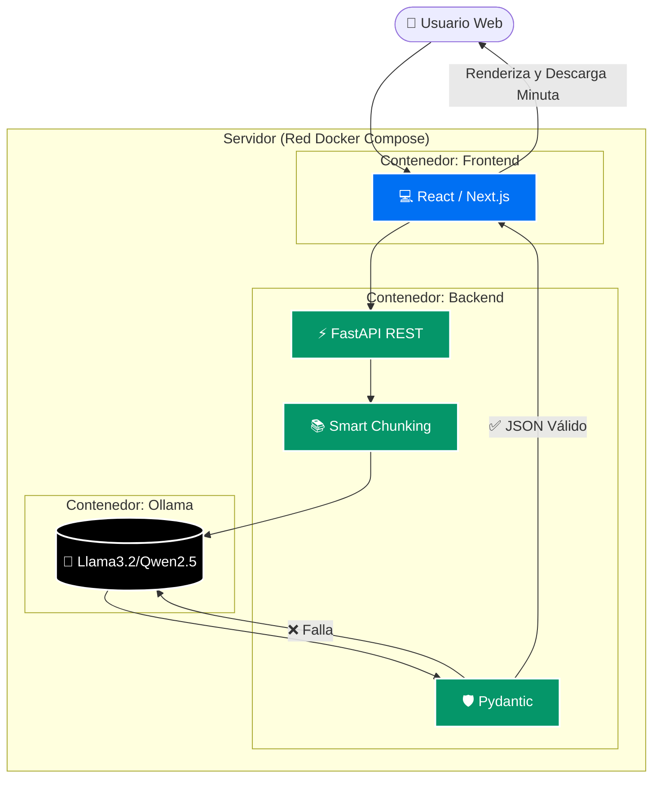

# 🚀 Minutas-IA V1 (Desktop Edition)

<div align="center">
  <p><strong>Guía de Arquitectura y Mantenimiento para Desarrolladores</strong></p>
</div>

---

Bienvenido al repositorio de **Minutas-IA V1**. Este documento es la guía técnica de traspaso para que cualquier desarrollador pueda tomar el proyecto, entender sus decisiones de diseño y continuar su mantenimiento fácilmente.

Esta versión **abandona los orquestadores web (como n8n) en favor de una arquitectura App moderna** (FastAPI + React), pensada para ser compilada como una aplicación de escritorio nativa que funcione 100% de manera local y autónoma.

## 🏗️ La Arquitectura V1 (¿Por qué cambió?)


La versión anterior (Legacy) dependía de orquestadores pesados. En V1 la arquitectura migró hacia FastAPI y React, permitiendo aprovechar todo el poder de servidores de **alto rendimiento (32GB RAM)**:

1. **Backend Ligero (`FastAPI` / Python)**
   - Gestiona toda la lógica pesada, enrutamiento y Chunking de documentos.
   - En lugar de confiar ciegamente en el LLM para generar JSON, utiliza **Pydantic** para estructurar un *contrato de datos estricto*. Si el LLM alucina un formato, el backend lo intercepta y reintenta.
2. **Frontend Reactivo (`Next.js` / React)**
   - UI limpia y rápida, diseñada con vistas a ser empaquetada mediante frameworks de escritorio (ej. Tauri/Electron).
3. **Motor de IA (`Ollama`)**
   - Al contar con 32GB de RAM, se pueden cargar modelos avanzados (ej. `Llama3:8b` o `Qwen2.5:14b`). Estos proveen un razonamiento impecable, previenen alucinaciones y devuelven JSON perfecto.

## 📂 Dónde Encontrar las Cosas (Estructura)

- `backend/`: Aquí vive FastAPI. Cualquier cambio en la extracción semántica, el algoritmo de Chunking o el esquema JSON va aquí.
  - `backend/agent/`: Lógica de comunicación con el LLM.
- `frontend/`: Aplicación Single Page Application en Next.js.
- `shared/`: Modelos de datos (tipos) compartidos entre Front y Back para mantener coherencia de contratos.
- `INICIAR_MINUTAS.bat`: Script maestro para levantar todo el entorno de un solo clic.

## ⚙️ Requisitos Previos (Prerequisites)

**Para Despliegue en Producción (Servidor):**
- **Docker Engine y Docker Compose** (Administrado vía Portainer).
- **Ollama** corriendo en el host del servidor con el modelo descargado (`ollama run qwen2.5:14b`).
*(En el servidor no necesitas instalar Python ni Node.js, ya que todo se encuentra encapsulado en los contenedores).*

**Para Desarrollo Local:**
- Python 3.11+ y Node.js 20+ (Solo si vas a usar el script `./INICIAR_MINUTAS.bat`).

## 🚀 Cómo Levantar el Entorno Local

```bash
# 1. Clona el proyecto
git clone https://github.com/mbaigorriaia-design/minutas-iaV1.git
cd minutas-iaV1

# 2. Ejecuta el script de inicio
./INICIAR_MINUTAS.bat
```
*(Nota: Asegúrate de tener instalado Ollama en tu máquina y el modelo avanzado descargado usando `ollama run qwen2.5:14b`)*

## ⚠️ Guía de Resolución de Problemas (Troubleshooting)

1. **Memoria Insuficiente (OOM) al procesar un documento de Word masivo:**
   - Si la aplicación crashea, significa que el tamaño del *Chunk* enviado al LLM excede la ventana de contexto o la RAM física de la laptop. Debes ajustar el porcentaje de *overlap* (10-15%) o el tamaño del paquete en el script de Chunking del `backend`.
2. **El Frontend no recibe el JSON esperado:**
   - La validación de *Pydantic* probablemente está rechazando una alucinación del LLM. Revisa los logs de FastAPI (`backend`). Para arreglarlo, ajusta el *System Prompt* en la lógica del Agente para ser más explícito con el formato requerido.
3. **El modelo genera basura léxica:**
   - Asegúrate de que el modelo configurado en Ollama sea el correcto (idealmente Qwen 2.5 de 14B o Llama 3). Los modelos pequeños suelen "romperse" semánticamente; **usa siempre versiones de 8B o 14B** para aprovechar los 32GB de RAM.

## 🚀 Roadmap & Trabajo Futuro (Performance API)

Oportunidades de mejora arquitectónica para escalar la velocidad y la experiencia de usuario (UX):

1. **Streaming de Respuesta (Server-Sent Events):** Implementar SSE en FastAPI para que el Frontend de React muestre cómo se va "escribiendo" la minuta en tiempo real (estilo máquina de escribir). Esto elimina por completo la ansiedad del usuario durante tiempos de espera largos.
2. **Decodificación Restringida (Instructor Library):** Forzar matemáticamente a Ollama a escupir tokens que coincidan *únicamente* con el esquema JSON (usando `Instructor` o `format: "json"`). Esto reduce los errores de validación de Pydantic a 0% y evita reintentos costosos.
3. **Vectorización Diferida (RAG Local):** Integrar FAISS o ChromaDB en FastAPI para no saturar la RAM leyendo documentos de Word completos de 50 páginas. El sistema buscará matemáticamente solo los párrafos relevantes antes de enviarlos al LLM.
4. **Feedback de Chunking en Tiempo Real:** Que FastAPI emita eventos asíncronos cada vez que termina de analizar una página (ej: `"Analizando 30% completado..."`) para otorgar transparencia total en la UI sobre la performance del motor.
